# UCAS Schedule WakeUp Exporter —— 将课表导出为 wakeup 课程表可识别的表格格式

国科大（中国科学院大学）课表导出工具：通过 [kb.mooc.ucas.edu.cn](https://kb.mooc.ucas.edu.cn/res/pc/curriculum/schedule.html)（超星课表国科大部署）的身份认证，爬取**所有学年学期**的课程，按学期分别导出 [WakeUp 课程表](https://wakeup.fun) App 可直接导入的 Excel/CSV 文件。

本项目针对的目标网站为[国科大的学习通课表网页](https://kb.mooc.ucas.edu.cn/res/pc/curriculum/schedule.html)，但项目中的抓取逻辑，适用于任何在学习通上可看到课表的学校，参考学校的具体情况修改 URL 即可。

提供两种使用方式：**作为 Agent Skill 使用**（对话式引导，推荐）或**直接运行 Python 脚本**。


## 写在前面

本教程涉及到代码部分的东西，crawler逻辑实现、skill封装，均由ai完成，但效果经过多次验证，写本教程的目的是帮助同学节省时间，分享我在解决课表过程中遇到的疑点和坑，行不通之处可与我多多讨论！

当然，我能用ai完成，每个人也都能用ai完成，也可以自己尝试与ai一步步对话，最终解决课表表格文件的数据获取和导出问题（实测使用workbuddy+hy3的组合也能解决这个问题）。


## 为什么会有这个教程

wakeup在更新后失去了对国科大sep系统的兼容，参考之前的教程直接在wakeup软件中从教务系统导入课表时，会出现课表无法区分具体上课周的问题，直接导入的话，会把你所有的课都放在同一周里，甚至会出现重叠的情况。（亲自试过的同学应该知道这里有多奇怪）。

安卓手机可以通过安装旧版本apk来解决（见新生群），苹果手机手机由于没有低版本的wakeup，这个问题不太好解决。另外，还有其他同学写的模拟选课网站（礼貌引用，小红书上搜索“国科大选课”应该能轻松找到相关讲解）：https://courseplanner.cysdy.cn 也非常的实用，但听说似乎有数据不是最新版本的问题

所以本教程利用wakeup app可以excel/csv表格导入的功能，从课程网页上抓取得到课程的详细数据，然后整理得到指定格式的csv文件，这样就可以直接导入到wakeup软件中了。


## 前期准备

### 学习通认证

加入国科大组织（或对应学校组织）：我—设置—账号管理—绑定单位—添加单位—中国科学院大学—输入学号—绑定+登录成功，然后就可以学习通扫码登录，完成身份认证。

<div style="display: flex; flex-direction: row; gap: 10px; align-items: flex-start; overflow-x: auto;">
  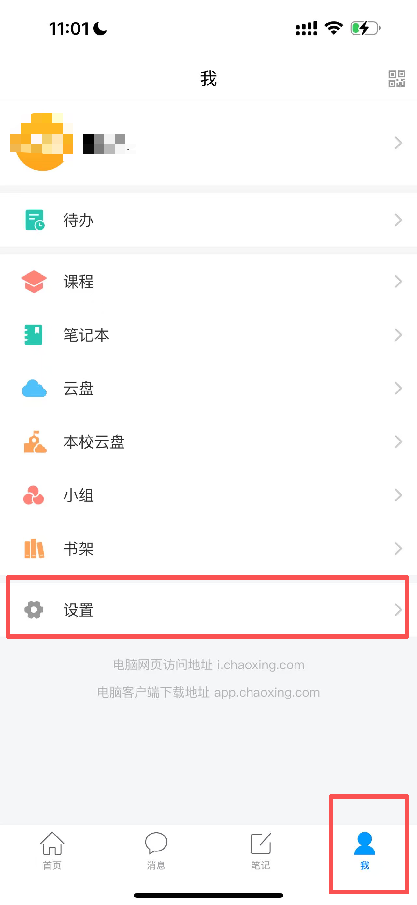
  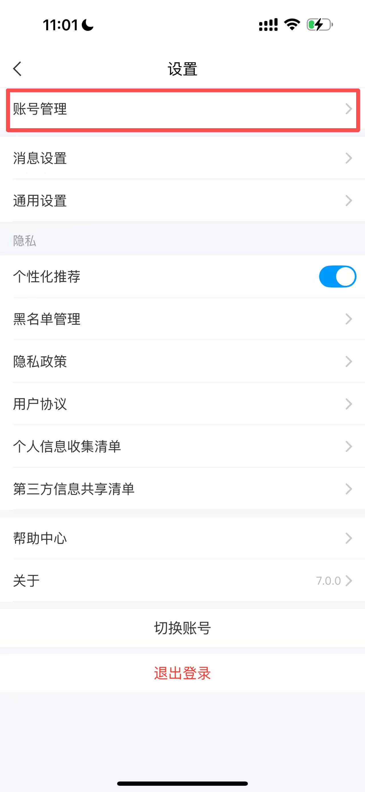
  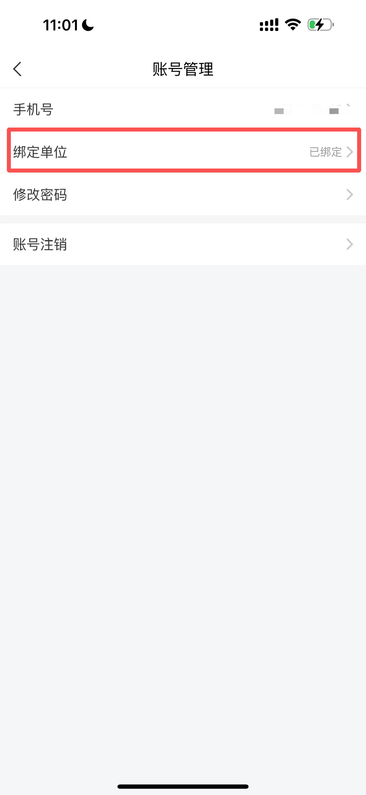
  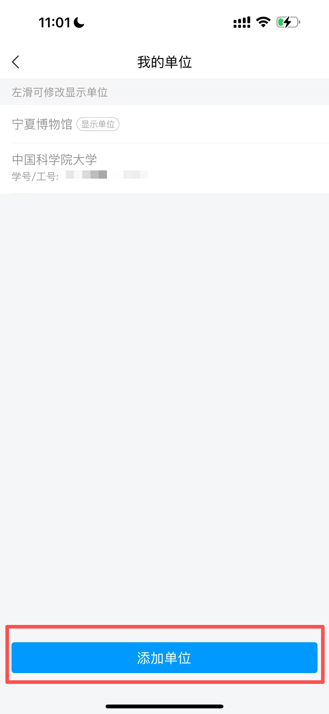
  
  
</div>

### 将wakeup设置成UCAS的形状

在**课表数据**中修改开学日期，修改每天课程节数为13节、学期周数为20周（以2026-2027秋季学期为例）

<div style="display: flex; flex-direction: column; gap: 4px;">   
       
       
     
     
     
     
</div>

在上课时间中，手动修改时间表，把每天13节课的时间修改好（因为早上是8点半上课，所以跟wakeup的默认上课时间无法对齐，需要手动调整）


## 工作原理

- 课表数据接口 `GET /pc/curriculum/getMyLessons` 需要登录态（Cookie 中含 HttpOnly 凭据）
- 该接口**不带 `week` 参数时只返回当前周**的课程，因此工具会逐周（week=1..maxWeek）扫描再按课程唯一 ID 去重，得到整学期完整课表
- 导出为 WakeUp 官方 7 列导入格式（见 [官方文档](https://wakeup.fun/doc/import_from_csv.html)）：`课程名称 | 星期 | 开始节数 | 结束节数 | 老师 | 地点 | 周数`，周数支持 `1-16`、`7-11单`、`2-5、7-20` 等写法，老师/地点缺失自动填"无"

## 仓库结构

```
ucas-schedule-wakeup/
├── README.md                        # 本文件
├── login_browser.py                 # 入口：弹浏览器登录学习通，保存登录态
├── crawl.py                         # 入口：爬取全部学期并导出 WakeUp 文件
├── requirements.txt                 # Python 依赖
├── .env.example                     # 环境变量模板（复制为 .env 填入 Cookie）
└── ucas-schedule-export/            # Agent Skill（也可独立使用）
    ├── SKILL.md                     # Skill 引导逻辑（供 Agent 读取）
    └── scripts/
        └── ucas_crawler.py          # 核心工具（子命令：doctor/login-browser/
                                    #   save-cookie/check/crawl/export）
```

登录态文件统一保存在 `~/.ucas_schedule/`，两种使用方式共享，跨会话可复用。

## 方式一：作为 Agent Skill 使用（推荐）

适用于 [ZCode](https://zcode.zhipuai.com)、[Workbuddy](https://www.workbuddy.cn/)、[Kimi](https://www.kimi.com/) 等支持 Agent Skill 机制的 AI 工具。

以workbuddy为例，导入方式见下图：

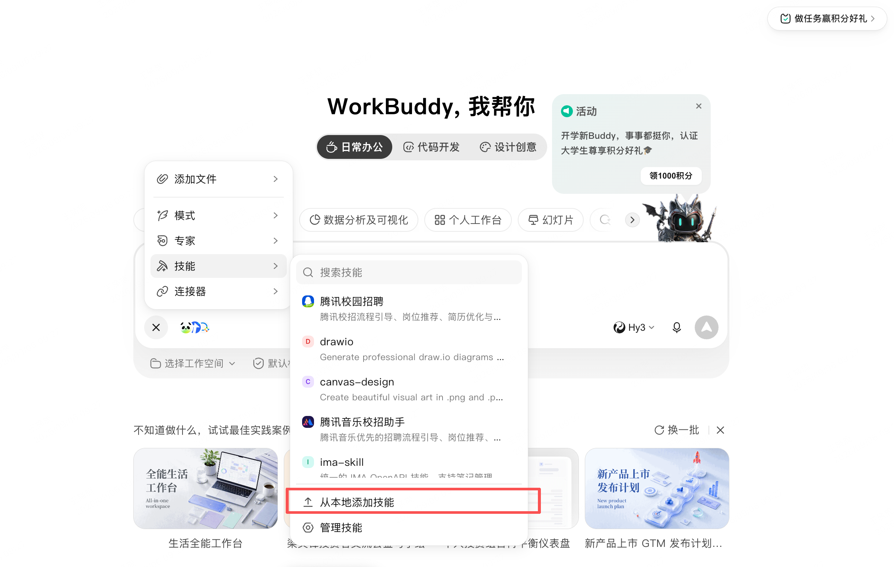

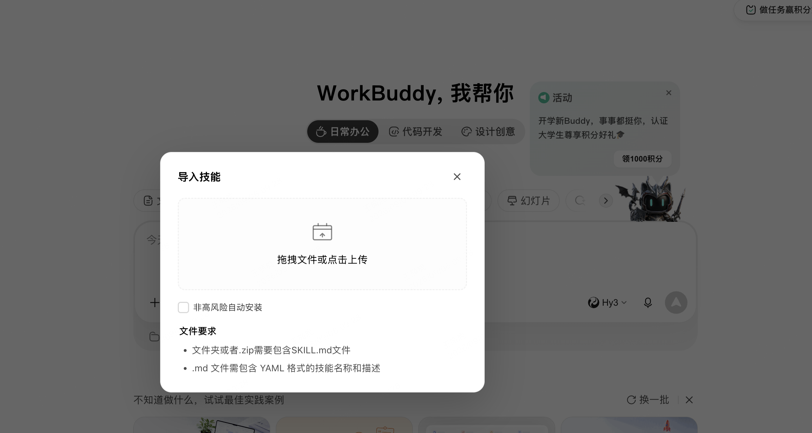

### 安装 Skill

**方法 1：手动安装（不建议）**——先克隆仓库到本地：

```bash
git clone https://github.com/ProerLoneW/ucas-schedule-wakeup.git
```

然后把 `ucas-schedule-wakeup/ucas-schedule-export` 文件夹作为技能加入你的 agent 软件，任选其一：

- **拖拽导入**：在支持技能导入的软件里，直接把 `ucas-schedule-export` 文件夹拖到技能/插件导入区域；

手动安装后需自行装好 Python 依赖：（可选，agent 在执行 skill 时遇到卡壳了也会自己安装）

```bash
pip3 install openpyxl playwright
python3 -m playwright install chromium   # 仅浏览器登录方式需要
```

**方法 2：一句话让 Agent 自己安装**——把下面的提示词整段发给任何能执行命令的 Agent（ZCode、Workbuddy、Kimi 等）：

```text
请安装 GitHub 上的 ucas-schedule-wakeup 课表导出技能
下载地址：https://github.com/ProerLoneW/ucas-schedule-wakeup.git
技能的所在的文件夹是仓库下的 ucas-schedule-export 文件夹
全部完成后告诉我结果，以及如何使用这个技能。
```

无论哪种方法，安装完成后**新开一个对话**即可生效。

### 接着与 Agent 交互

安装后**新开一个对话**，正常描述需求即可触发，例如：

- "帮我爬一下我国科大的课表，导成 WakeUp 能导入的格式"
- "我的 kb.mooc.ucas.edu.cn 课表想导出 Excel"
- （推荐）“参考仓库中的README文件，一步一步带我爬取课表，然后导出结果”

也可以用斜杠命令强制触发：`/ucas-schedule-export 导出本学期课表`

Skill 会引导你完成认证（**二选一，随时可切换**）：

| 认证方式 | 过程 | 适合场景 |
|---|---|---|
| **Cookie 导入** | Agent 教你在浏览器 F12 → Network 里复制整串 Cookie，粘贴给 Agent 验证 | 不想装 playwright；已在浏览器登录过 |
| **学习通账号登录** | Agent 运行脚本弹出浏览器，你扫码或输入账号密码登录，脚本自动检测并抓取 Cookie | 想要一次登录长期复用 |

认证通过后 Agent 自动爬取全部学期并导出文件，最后把文件路径列表给你。


## 方式二：直接运行 Python 脚本

### 环境准备

```bash
git clone https://github.com/ProerLoneW/ucas-schedule-wakeup.git
pip3 install -r requirements.txt
python3 -m playwright install chromium   # 仅浏览器登录方式需要
```

### 认证方式 A：Cookie + 环境变量（`.env`）

```bash
cp .env.example .env        # 然后编辑 .env，填入 UCAS_COOKIE
python3 crawl.py            # 或 export UCAS_COOKIE="..." 后直接运行
```

**Cookie 获取步骤**：

1. 浏览器进入到【课表页】，按提示登录（跳转到 passport 统一认证，扫码/手机号+学习通密码/机构账号"中国科学院大学"+学号均可）

进入课表页的方式：sep系统—课程学习—课表

Step1：

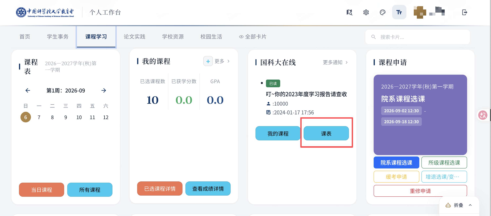

Step2：

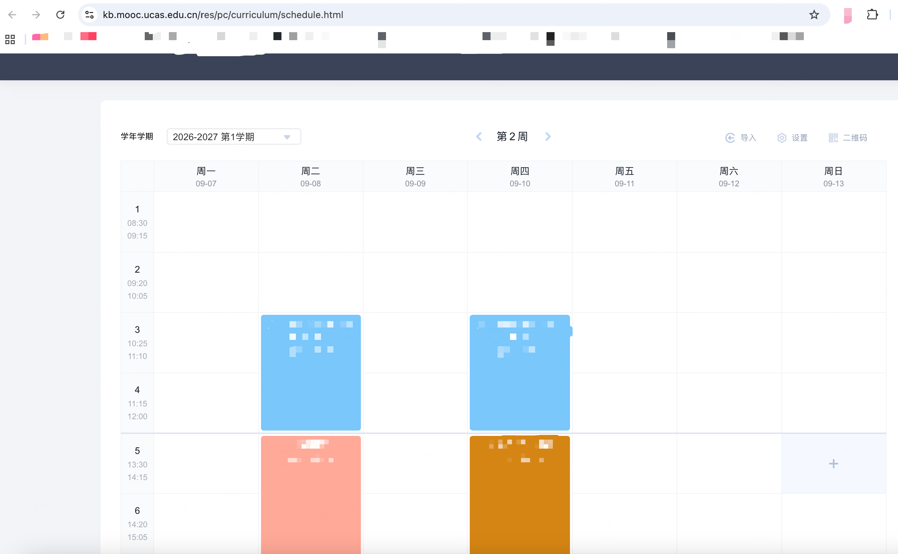

2. 登录跳回课表页后，按 F12（或右键—点击inspect） → **Network** 标签 → 刷新页面


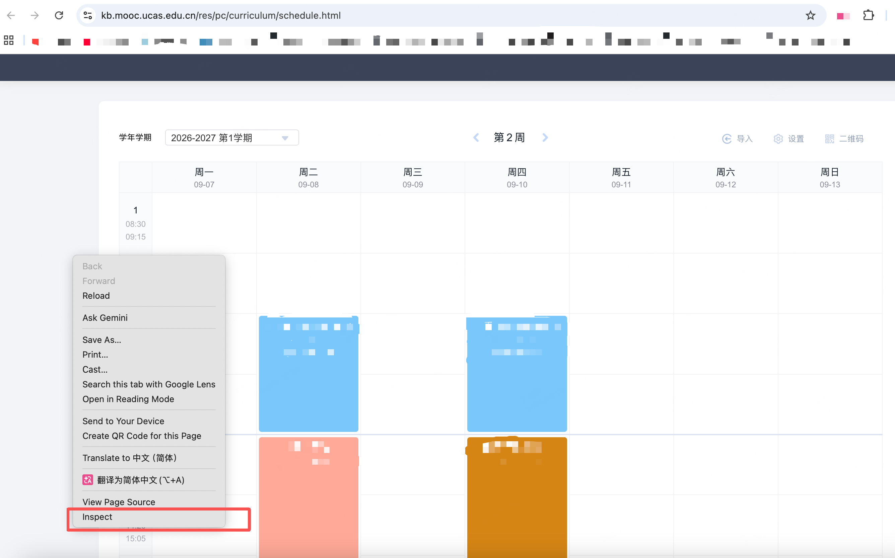

3. 点击任意一个发往 `kb.mooc.ucas.edu.cn` 的请求（如 `getMyLessons`）

4. 在 **Request Headers** 里找到 `Cookie:` 一行，复制**整串值**填入 `.env`

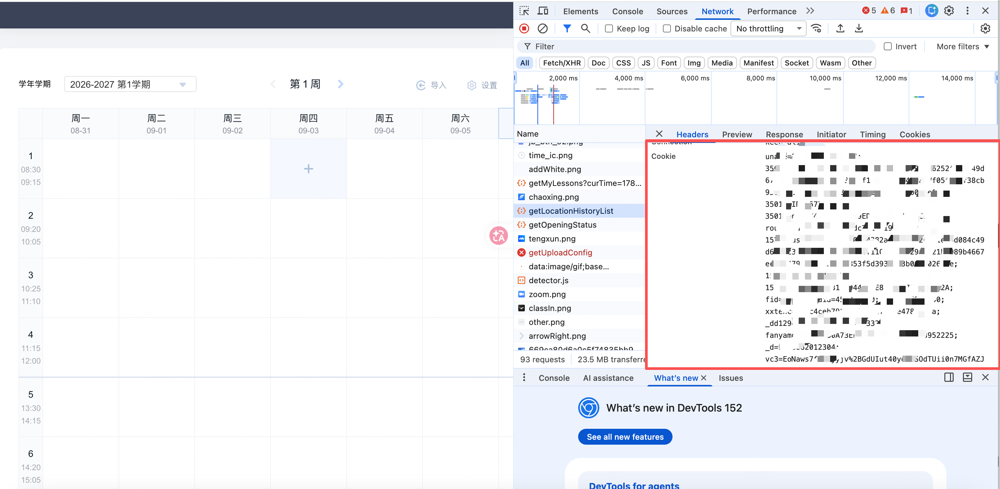

> ⚠️ 必须从 Network 请求头复制。控制台 `document.cookie` 读不到 HttpOnly 凭据（如 vc3），缺了会被服务器 302 踢回登录页。

### 认证方式 B：弹浏览器登录学习通

```bash
python3 login_browser.py           # 弹出浏览器，扫码/输密码登录
python3 login_browser.py --relogin # 登录态失效时强制重登
```

登录成功自动保存到 `~/.ucas_schedule/`，之后直接运行 `crawl.py` 即可，无需重复登录。

### 爬取导出

```bash
python3 crawl.py                  # 登录态自动取自 .env / 环境变量 / 已保存文件
python3 crawl.py --out ./output   # 指定输出目录
python3 crawl.py --no-merge       # 教务课程不合并，更细粒度
```

输出（每个**有课**的学期一组文件）：

```
WakeUp课表_2026-2027第1学期.xlsx   # Excel 版，方便自行查看修改
WakeUp课表_2026-2027第1学期.csv    # WakeUp 导入用（App 内 课表→导入→Excel导入）
schedule_all.json                 # 接口完整原始数据留档
```

**导入 WakeUp**：App 内右上角导入 → Excel 模版导入，选择 `.csv` 文件（`.xlsx` 亦可）；每个学期导一次，在 App 内切换课表。


## 其他方法

除了本方法以外，还尝试过参考wakeup教程去获取html文件（失败）以及在下面这个个人课表的地方做爬虫爬取（成功），但需要解决页面上没有展示周信息的问题，这个要引入跳转的逻辑，整体爬取速度较慢，感兴趣的朋友可以自己尝试：

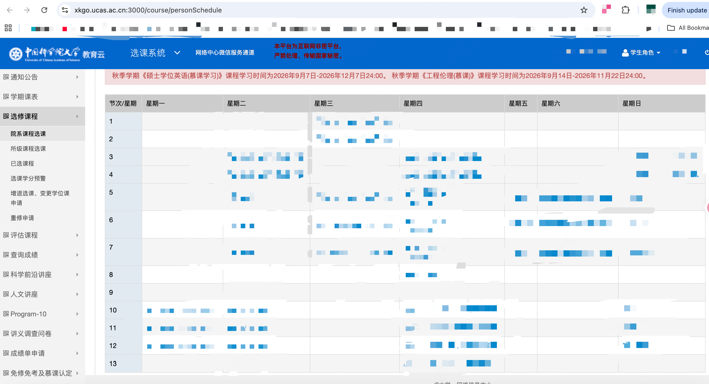


## 常见问题（AI生成，不用看）

- **提示"用户信息异常，请登录后再试" / 登录态无效**：Cookie 复制不完整（缺 HttpOnly 项）或已过期。重新从 Network 请求头整串复制，或改用 `login_browser.py`。
- **某个学期没有生成文件**：该学期全学期无课程（接口逐周扫描均为 0）属正常；第 1 周课少/为空也是正常现象。
- **登录页密码正确但没反应**：页面内嵌文字点选验证码或双因子认证，在浏览器里按提示完成即可。
- **出现 SSL 证书警告并自动降级**：macOS 自带 Python 缺根证书所致，可运行 `/Applications/Python*/Install\ Certificates.command` 修复；不影响功能。
- **只想重新生成表格不想重新爬**：`python3 ucas-schedule-export/scripts/ucas_crawler.py export --json schedule_all.json`


## 项目支持

All completed by Zcode+glm-5.3.
